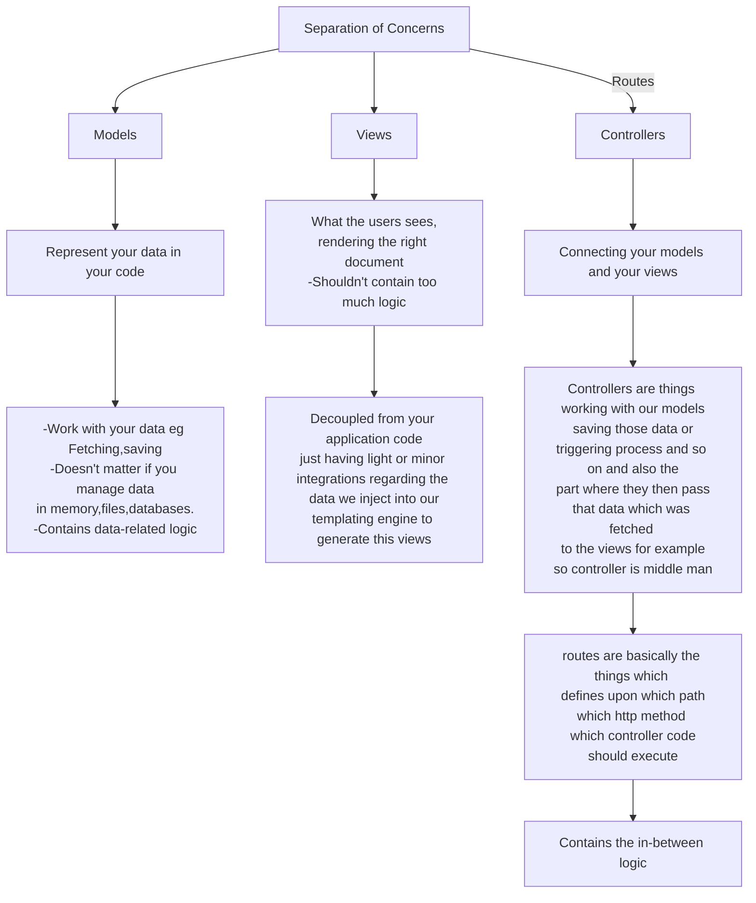

### What's MVC ?

#### FLOW OF THIS FILE 

- server.js ( mentions the routes of routes/admin.js and routes/shop.js ) 
    - as the request comes it is passed on to the proper controller functions mentioned in <i>controllers/</i> , using router.get or router.post based on the method of the incoming request.

- The controller function renders the views from <i>views/</i> using res.render and get the variables/data required from the model ( see <b>Product.fetchAll()</b> in <i>controllers/admin.js</i> ) or send it to the model for storing it. ( see <b>Product.save()</b> in <i>controllers/admin.js</i> ).

- all this functions are exported from <i>model/product.js</i> file to the controllers for use. implementations are mentioned in <i>model/product.js</i>. similarly the views are written in the view folder (not much logic).

- thus the controllers are middleman 
- Therefore implementing MVC pattern of software design 

#### IN THIS FILE 

- routes
    - admin.js
    - shop.js
    - Forward the incoming route to the proper controller.

- Controllers
    - admin.js
    - errors.js
    - shop.js

    - Controllers get the I/O functions and data operations from     
        - models
            - product.js
    
    - Controllers get the Views to render from 
        - views
            - admin
                - add-product.pug
                - edit-product.pug
                - product-list.pug
            - layouts
                - main-layout.pug
            - shop
                - cart.pug
                - checkout.pug
                - index.pug
                - orders.pug
                - product-detail.pug
                - product-list.pug
            - 404.pug

