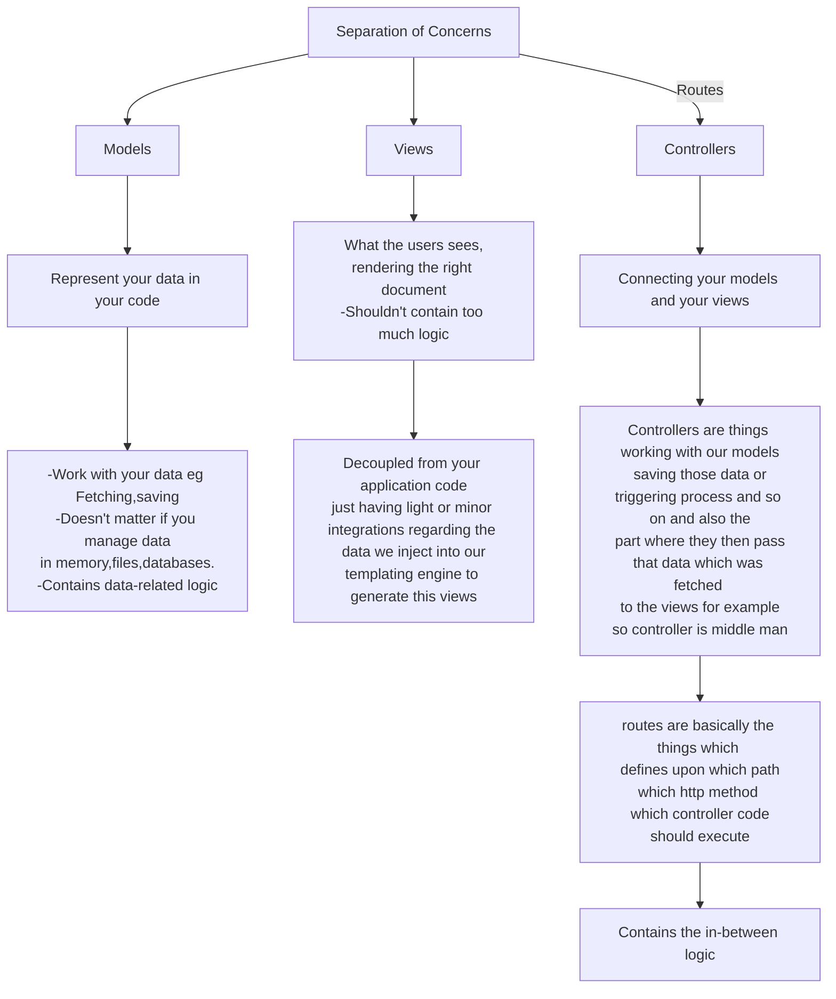

### What's MVC ?

```mermaid
graph TD;
    A[Separation of Concerns] --> B[Models] --> C[Represent your data in your code] --> D[-Work with your data eg Fetching,saving\n-Doesn't matter if you manage data\nin memory,files,databases.\n-Contains data-related logic];

    A -->  E[Views] -->  F[What the users sees,\nrendering the right document\n-Shouldn't contain too much logic] --> G[Decoupled from your application code\njust having light or minor integrations regarding the \n data we inject into our templating engine to generate this views ];
    
    A -- Routes --> H[Controllers] --> I[Connecting your models and your views] --> j[Controllers are things working with our models\n saving those data or triggering process and so on and also the\n part where they then pass that data which was fetched \n to the views for example so controller is middle man]--> l[routes are basically the things which \n defines upon which path which http method \n which controller code should execute ]  --> k[Contains the in-between logic];
```

