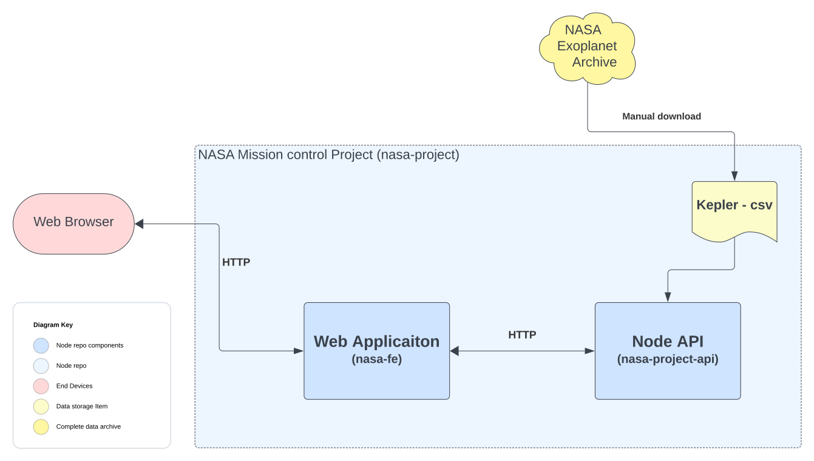

- ### Project structure

- root
    - client 
        - package.json - configuration for client
    - server (MVC)
        - routes (controllers included in here only)
        - models
        - server.js (starter file)
        - package.json - configuration for server
    - package.json - configuration for overall project

- #### How do we run our project in production ? 
    - our server runs on port 8000 and our client runs on port 3000
    - when we run our project in production we often want to run the entire thing on one server somewher ein the cloud.
    - ideally we have the ability to serve our front end from the same server as our API. this way we don't have to manage two separate servers at differnt URLs or with different ports.
    - the way we usually do this is in our clients , if we are using some framework like react or flutter we'd first build our project, including  our framework our source code and any assets we are using into a single build folder that's optimized for production. 
    - therefor "npm run build" in client folder , which will create a optimized production build from our source code.
    - now move the content of build folder in client to the server/public folder to serve it from the server. 
    - we can also automate this task using scripts in root folders package.json file.

- #### Architecture

    

