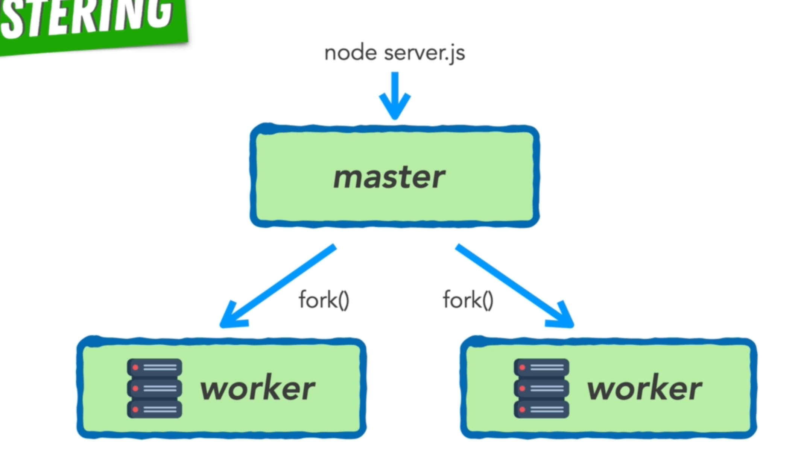

### response time

you want to keep your respones time below 100-150 ms

- [response time 3 important limits](https://www.nngroup.com/articles/response-times-3-important-limits/)
- [web performace monitoring - User engagement ](https://speedcurve.com/blog/web-performance-monitoring-user-engagement/)

### balancing load

- as we know that node.js and javascript only offers a single thread , we might not be able to take the full advantage of multi cores.

- So rather than taking in each request and handling it in one Node.js server with one node process,

    

- we can instead spread our requests out between multiple Node.js processes, that each respond to that request in the same way. They each contain a copy of your server code that's running side by side in parallel. and so now these second requests can be handled by the second node process, and the third request can be handled by the third node process and so on and so forth.
- if we have more requests then servers well, each of these processes can handle multiple requests at a time. the important part is that they're now sharing the load equally between them. using this technique allows your single threaded node applications to make full use of all the CPUs on your machine.

    

- to achive the above node provides inbuit cluster module which allows us to create copies of the node process that each run server code side by side in parallel

### Clustering in node

[clustering]('https://nodejs.org/dist/latest-v18.x/docs/api/cluster.html')

- Clusters of Node.js processes can be used to run multiple instances of Node.js that can distribute workloads among their application threads. When process isolation is not needed, use the worker_threads module instead, which allows running multiple application threads within a single Node.js instance.

- The cluster module allows easy creation of child processes that all share server ports.

fork() - The worker processes are spawned using the child_process.fork() method, so that they can communicate with the parent via IPC (inter process communication) and pass server handles back and forth.

- The cluster module supports two methods of distributing incoming connections.
  - round-robin approach (except for windows)
    - Where the primary process listens on a port, accepts new connections and distributes them across the workers in a round-robin fashion, with some built-in smarts to avoid overloading a worker process.
  - The second approach is where the primary process creates the listen socket and sends it to interested workers. The workers then accept incoming connections directly.
- The second approach should, in theory, give the best performance. In practice however, distribution tends to be very unbalanced due to operating system scheduler vagaries. Loads have been observed where over 70% of all connections ended up in just two processes, out of a total of eight.

### PM2
[pm2 docs](https://pm2.keymetrics.io/docs/usage/quick-start/)

pm2 has clustering build-in , so we don't need to fork the master process in the code , pm2 has commands to do the same and manage those processes.

- pm2 start server.js
- pm2 start server.js -i (instance)
- pm2 start server.js -i 2         ( starts two workers )
- pm2 start server.js -i max       ( starts maximum amount of workers possible )
- pm2 stop <name>
- pm2 stop <pid> ( temporariliy brings the process down)
- pm2 start <pid> ( restart the process )
- pm2 list
- pm2 show <pid>

- pm2 logs
- pm2 logs --lines 200 
- pm2 start server.js -l logs.text ( sending logs to a file and also supports log rotations)

- pm2 monit

- pm2 restart server ( closes all the process and restart them )
- pm2 reload server (close process one by one making sure that atleast one instant is live ) - zero downtime restart
    - This is the best way to update serversthat are already live and serving users, particularly with applications that are time sensetive. 