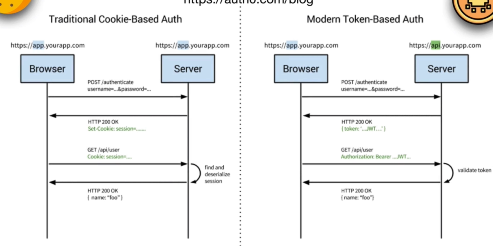

### Cookie
cookie is a piece of information stored on a browser by a particular server
and when the browser request against that server the stored cookies are always send
with the request.

- cookies can be path specific , implies that "only send certain cookies when commmunicating with certain endpoint at the server"
- cookies also haave expiration date set by server and size limit imposed by browser
- cookies can be made httpOnly which will make that cookie only accessible via https and are not accesible from javascript code, which means the server has more control over the value in that cookie. this is to prevent certain security issue like cross-site scripting attack, where a hacker manages to load some javascript into your browser thats executing on a site you trust and can then execute that code with all of your permissions and acces to all your data for that site. there this flag is important where the cookie might contain sensitive value.
- cookie can be set as secure which when done the browser will only send that cookie over https.

- we can also do authentication with cookie 

        
- with token based authentication the browser authenticate with server by checking that the user's username and password mmatch at which point, if the server agrees that this matches a known user's credentials, the server will send back somme access token in the response. for example, a token that follows the JWT standard, and it's then up to browser to send that token in every request that it makes to the server so that the server can validate that token by checking that the token belongs to the user/browser sending the token and give him the data he needs in the response to his request. this token needs to be sent in the authorization header by the developer each timme you want to make an authenticated request.
- when we do authentication with cookie, the authentication step would work in much the same way, the server would make sure that the user's credentials matches a known user but rather than sending a token in response, the server sets this cookie value , which can store different bits of informmation, even an access token or a session identifier. this would be somme data that uniquely identifies the user currently browsing your server/website. these cookie values are set when the server responds with this `Set-Cookie` header which the browser knows means that these values need to be stored in the browsers cookies. from now on, that cookie value will automatically be sent by the browser whenever the browser makes a request against the server. it will set the `Cookie` header with any of the values that have been set by the server previously. 
- insted of looking in the authorization header, the server can now look inside the cookie check it and see okay I know who the user is and they have already authenticated and are allowed to access this user data so I can send the response.
- Both cookies and tokens sent in the authorization header provide two different ways of passing authentication data to the server. they're both often used to prove to the server who is browsing that site, but to really understand these usecase lets understand more about sessions.

### Sessions

Sessions are a way of storing data about the current active user. this could be something like the name of the user or what page of a site they last visited. however, usually public data like a user's name can be stored on the client's side in the browser without worrying about any server side session, there's no reson to keep this data secure.

on the other hand, what should definitely live in a session is data that we wouldn't want the user in their browser to modify like 'bank balance' or their permissions to access data in the server. for this type of information, the client can have access to it (the client can read it) but shouldn't be able to  changed it. this is were we need session to keep track of the state of such data.

it is similar to usecase of a database however sessions are usually short lived. Sessions captures the state of an application during the timme that a user is interacting with it. the data in a session is what is relevent to user as they're using the appication until they quit or log out, whereas the data in a database is more permanent.
- example - if you are on a shoping site, the current items in your shopping cart might be in a session while your order history might live in a database that persists through many session. the database sticks around regardless of who's logged in or which browser you're using on which machine, whereas session tend to be tied to a specific browser and the temmporary state of the application on that browser.

how do we store session data ? Two ways
- Server-side sesisons - where the user data lives in server on a database somewhere and the data would get looked up for each request that the user makes and potentially deleted if the user logs out or quite their browser.
- Client-side sessions - where we store session data in the browser, specifically in the browser cookies.In fact, cookies are almost always used to implement sessions, although we do things slightly different in the cookie depending on if we're using the client-side session or a server side session(stateful cookies).

     - with stateful cookies , cookie value is just a session ID which is a reference, a pointer to some session information that lives in a database somewhere in the server here we require database to store our session data and our server needs to look up the session in that database for the user identified by the session ID. (adds load to the server for database lookup for each user requesting).
 
     - with stateless cookie and client-side session, all the session-informamtion server needs lives in the client, its stored in the browsers cookies. Each piece of session data corresponds to one cookie value. In this case, the serve cn still trust that the cookies haven't been tampered with as long as the sever sings (with a secret key which server has exlusive access to) the user's cookies before they're sent to the clients. Now if the browser without that key tries to modify the cookie with the session, when server tries to read that value, it'll know that cookie is invalid and has been tammpered with and not authorized the user to make whatever request they're making.

### cookie-session

- its a client-side cookie storing module
    - cookie-session does not require any database/resources on the server side, though the total session data cannot exceed the browser's max cookie size.
    - cookie-session can simplify certain load-balanced scenarios.
    - it can be used to store a "light" session and include an identifier to lookup a database-backed secondary store to reduce database lookups

- when imported it returns a function with signature - cookieSession(Options)
- supported options
    - name (defaults to "session").
    - keys -> list of keys use to sign and varify cookie value. always sign with keys[0] while others are valid for varification.
    - secret -> a string which will be used as a single key if key is not provided.
    (Other cookie options)
    - overwrite - true(default) - wheather to overwrite previously set cookies of the same name
    - httpOnly - true(default) - only sends cookie over https and not made availabe to client javascript
    - secure -> boolean (only sends cookie over https)
    - signed - true(default) - a boolean indicating wheather the cookie is to signed
    - maxAge (in secs)
    - expires (Date Object)

- when the cookieSession(Options) is called it returns a express/connect supported middleware `cookieSession(res,req,next)`.

```javascript
app.use(cookieSession(Options)) // returns cookieSession(res,req,next)
```

- this middleware populates req object with sessionOptions and session
```javascript
req = {
    ...
    sessionOptions = {
        // ... options we have passed to the cookieSession function
    }
    session = {
        get: getSession // fn - get the session if available or creates a new one.
        set: setSession // fn - sets an session to an object or null
    }
}

```

### Referances
- [Use this to decode the stored cookies](https://www.base64decode.org/)

