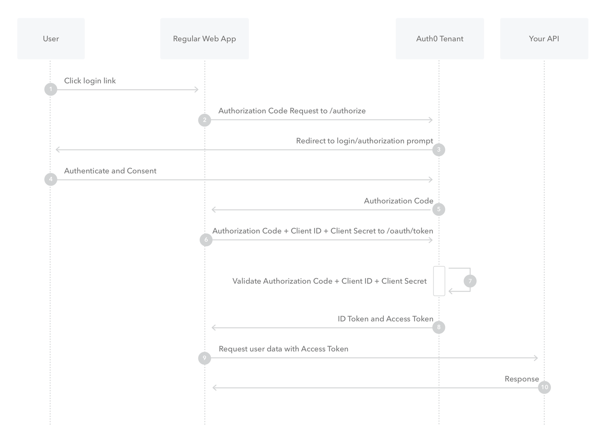

### OAuth

OAuth 2.0 is a standard that apps use to provide client applications with access. If you would like to grant access to your application data in a secure way, then you want to use the OAuth 2.0 protocol.

The OAuth 2.0 spec has four important roles:

- client: The application that wants to access some data.
- resource server: The API or application that stores the data the client wants to access.
- resource owner: The owner of the data on the resource server. For example, you're the owner of your Facebook profile.
- authorization server: The server that manages access and issues access tokens. In this case, Okta is the authorization server.

Other important terms:

- OAuth 2.0 grant: The authorization given (or granted) to the client by the user. Examples of grants are Authorization Code and Client Credentials. Each OAuth grant has a corresponding flow.
- access token: The token issued by the authorization server (Okta) in exchange for the grant.
- refresh token: An optional token that is exchanged for a new access token if the access token has expired.

The usual OAuth 2.0 authorization code flow looks like this:

1. User selects Login within application.
2. Auth0's SDK redirects user to Auth0 Authorization Server (/authorize endpoint).
3. Auth0 Authorization Server redirects user to login and authorization prompt.
4. User authenticates using one of the configured login options, and may see a consent prompt listing the permissions Auth0 will give to the application.
5. Auth0 Authorization Server redirects user back to application with single-use authorization code.
6. Auth0's SDK sends authorization code, application's client ID, and application's credentials, such as client secret or Private Key JWT, to Auth0 Authorization Server (/oauth/token endpoint).
7. Auth0 Authorization Server verifies authorization code, application's client ID, and application's credentials.
8. Auth0 Authorization Server responds with an ID token and access token (and optionally, a refresh token).
9. Application can use the access token to call an API to access information about the user.
10. API responds with requested data.

[OAuth flow](https://developer.okta.com/docs/concepts/oauth-openid/#what-kind-of-client-are-you-building)

### Oauth2 flow

### References

- [ Redirect vs. Embedded authentication](https://developer.okta.com/docs/concepts/redirect-vs-embedded/)
- [ Official OAuth doc](https://datatracker.ietf.org/doc/html/rfc6749)