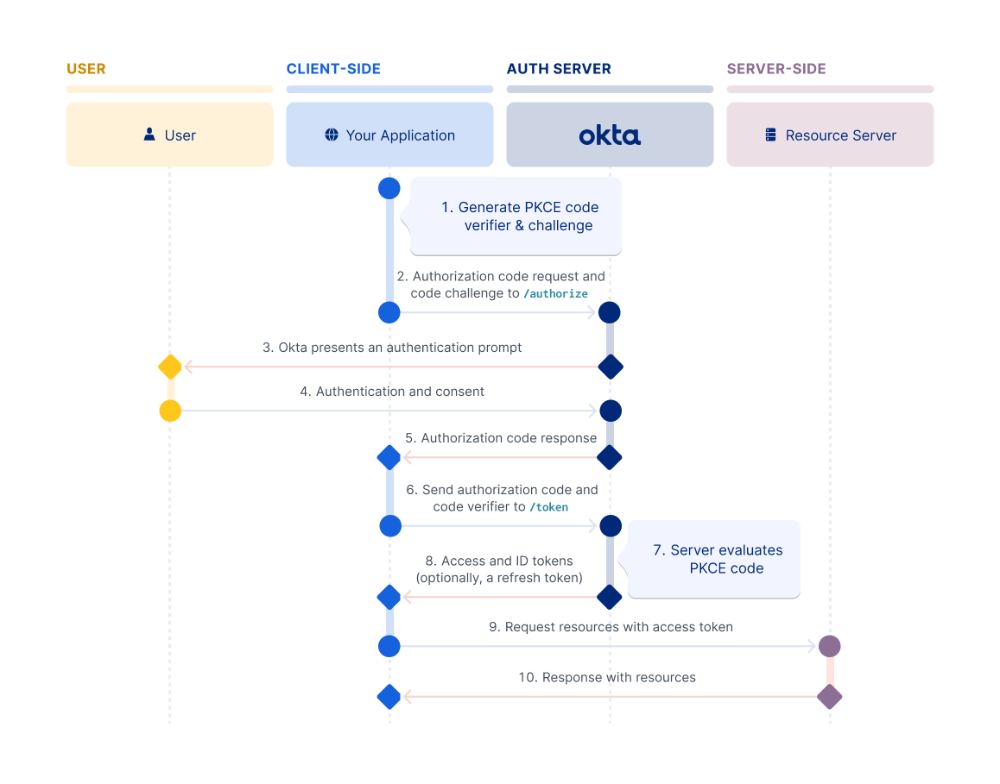

### OAuth

OAuth 2.0 is a standard that apps use to provide client applications with access. If you would like to grant access to your application data in a secure way, then you want to use the OAuth 2.0 protocol.

The OAuth 2.0 spec has four important roles:

- client: The application that wants to access some data.
- resource server: The API or application that stores the data the client wants to access.
- resource owner: The owner of the data on the resource server. For example, you're the owner of your Facebook profile.
- authorization server: The server that manages access and issues access tokens. In this case, Okta is the authorization server.

Other important terms:

- OAuth 2.0 grant: The authorization given (or granted) to the client by the user. Examples of grants are Authorization Code and Client Credentials. Each OAuth grant has a corresponding flow.
- access token: The token issued by the authorization server (Okta) in exchange for the grant.
- refresh token: An optional token that is exchanged for a new access token if the access token has expired.

The usual OAuth 2.0 authorization code flow looks like this:

- The client requests authorization from the resource owner (usually the user).
- If the owner gives authorization, the client passes the authorization grant to the authorization server (in this case Okta).
- If the grant is valid, the authorization server returns an access token, possibly alongside a refresh and/or ID token.
- The client now uses that access token to access the resource server.
[Okta OAuth flow](https://developer.okta.com/docs/concepts/oauth-openid/#what-kind-of-client-are-you-building)

### Detailed Authorization code with PKCE Flow

### References

- [ Redirect vs. Embedded authentication](https://developer.okta.com/docs/concepts/redirect-vs-embedded/)
- [ Official OAuth doc](https://datatracker.ietf.org/doc/html/rfc6749)

